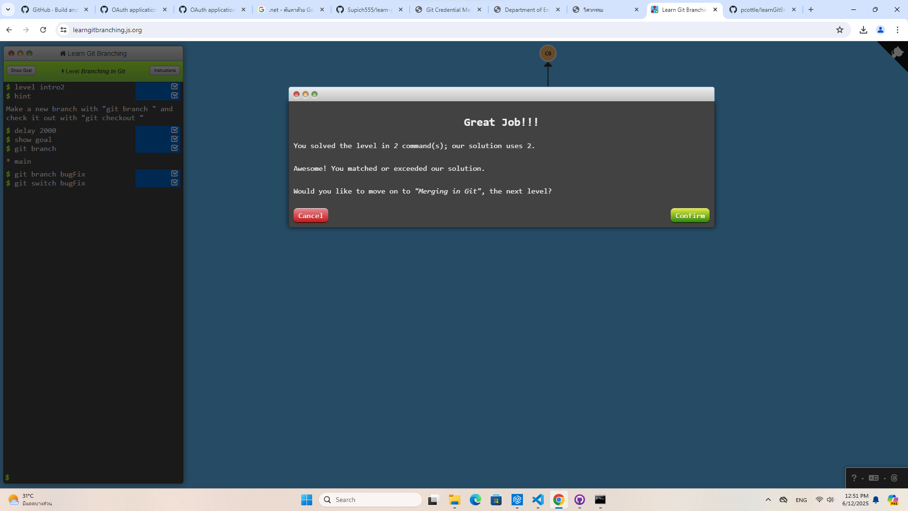
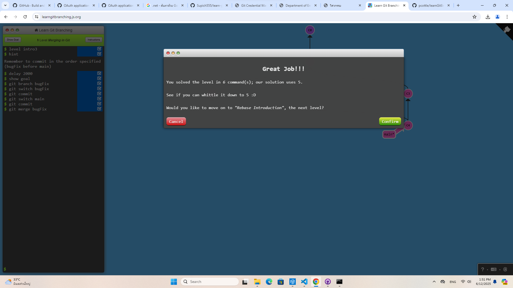
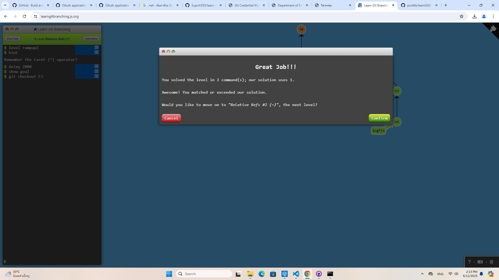
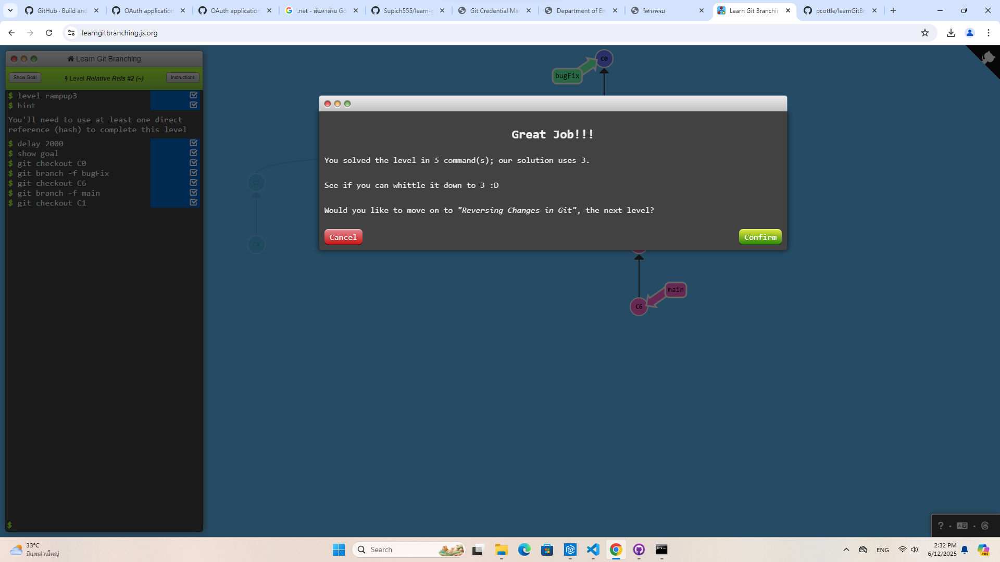
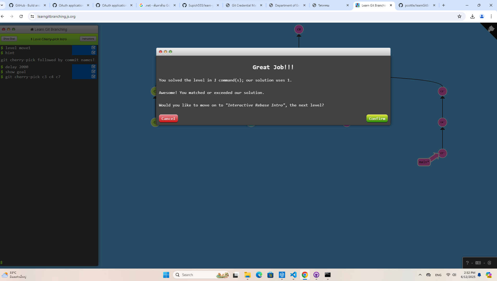
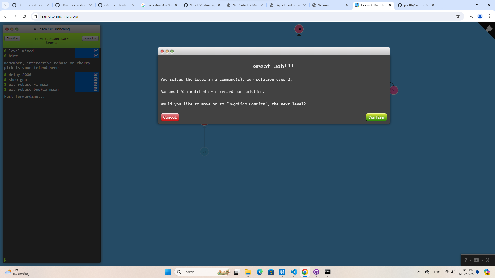

# level 1
# 1.1 git commit

# 1.2 (git branch , git switch)

# 1.3 (git commit , git branch ,  git switch , git merge)

# 1.4 ( git commit , git branch ,  git switch , git rebase)

# level 2
# 2.1

# 2.2

# 2.3 (git branch -f)

# 2.4 (git reset , git switch , git revert )

 
 # level 3 
 # 3.1( git cherry-pick c3 c4 c7)
 

 # 3.2( git rebase -i HEAD~4)
 

 # level 4
 # 4.1( git rebase -i main , git rebase bugFix main)
 